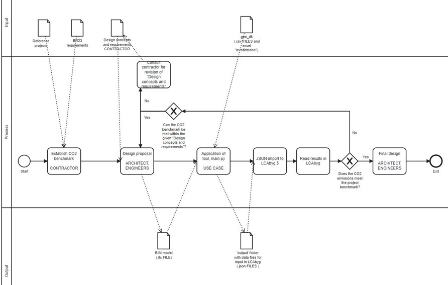

# 41934 Advanced BIM, Assignment 5 - Project Reflection
## Group 16: Isabella Vad (s183616) and Amalie Hartvig Jensen (s183619)

**The process of creating the tool**

The idea for this tool originated from experience with LCAbyg, understanding it as a software with a very time consuming and manual workflow. This complicates carrying out iterative design processes towards a more sustainable building design by lowering the CO2 emissions.   

In addition, as life cycle analysis becomes obligatory on larger buildings (>1000 m^2) by the Danish building regulations in 2023, a use case around the subject of integrating BIM in LCAbyg became increasingly relevant and the tool became likewise a great business case. 

For the time being, LCAbyg is incapable of direct integration with BIM via IFC. However, a third party integration via the JSON format is available. 
Thus the project goal was to create a tool that could retrieve necessary information from a BIM model through an IFC file and convert it into JSON files which would automatically generate results when imported in LCAbyg. 

The different project processes are described below:
- Scoping the project (goal, requirements, limitations). 
- Understanding the .json format and the .json files’ naming and layout required for LCAbyg, see Figure 1. This includes understanding the unique ID’s, the IDs connecting Nodes and Edges in the building model and the IDs referring to .csv files in LCA’s incorporated ‘gen_dk’ library.   

|  | 
|:--:| 
| *Figure 1, Edges required for the building model (source: Terese Pagh et al., _Json guide for LCAbyg version 5.2.1.0_ , page 28, BUILD, 2020 ).* |

- Identify which data is needed from the .ifc file and which can be referenced by ‘gen_dk’ library. 
- Reducing the scope to only encompass one IfcBuildingElement as an example, namely IfcBeams.   
- Coding in python:
  - Load and retrieve data from the .ifc file and create a matrix with the data.
  - Load necessary .csv files from ‘gen_dk’ library.
  - Setup templates for the .json files. 
  - In templates; reference to matrix for variable model data, generate unique ID’s and cross reference ID’s between .json files/.csv files.   
  - Automatic naming and generation of results as an ‘output’ folder with the final filled out .json files. 

Several options for the tool were considered at the beginning of the project. Both HTML, Speckle, web IFCjs were considered for the project platform however we chose to work exclusively in python. 
Another consideration regarded how to retrieve the EPDs associated to the materials in the BIM model. We investigated the possibility of doing web scraping from the Ökobaudat database, but we ended up using the generic database ‘gen_dk’ incorporated in LCAbyg as a simplified solution.

**The output of the tool**

The direct tool output is a folder containing 7 .json files which can be loaded into LCAbyg.

When applied, the tool has many potential benefits. 
The potential users which include both LCA consultants, engineers, and architects are able to assess LCA results much faster with the automated process of retrieving data in the .ifc file. This encourages users to make extra LCAs in progress of a building project and provides better guidance of the design towards more sustainable choices which is especially valuable  in the early design stages enabling time and economic savings.
The workflow in which the tool is implemented is displayed in Figure 2.

|  | 
|:--:| 
| *Figure 2, Schema of the tool workflow processes including input and output files.* |

**1. Process of developing the tool**

**Did the process of the course enable you to answer or define questions that you might need later for thesis?**

Yes. Our tool has great potential for a thesis project. Especially because we have not been able to incorporate all materials yet due to the time constraints. This can be done having more time, like in a master thesis where it can also be combined with more detailed IFC files and connected to collaboration with a company resulting in great business value. 

**Would you have preferred to have been given less choice in the use cases?**

No, we found it very inspiring to have every option open. It was a great guidance to chose within the main fields of interests where we chose LCA. 
The importance of scoping the project became very clear once the different parts of one's project were idetified. For a very broad use case, it’s necessary to have more time to focus on scripting.

**Was the number of tools for the course ok - should we have more or less? - if so which ones would you leave out?**

We think the number of tools have been a little too extensive. It was nice to expand our knowledge on different OpenBIM platforms, however a 5 ECTS point course is not big enough to acheive understanding of how to use all the tools. 
If this course becomes either a 10 ECTS points or a 3 weeks course it will be easier to learn more and work more focused.

**2. Output of the tool**

**Did the tool address the use case you identified?**

Yes, however due to the project’s time constraint the scope was reduced to encompass only beams.
In the python script, after retrieving data from the IFC file, we introduced a matrix to hold the data. 
This method are beneficial as the data could easily be extracted and put into the right places in the .json files. Furthermore, the matrix could easily be expanded to encompass more IFC elements and associated quantities for future development of the tool. Eventually, as the matrix itself holds neccessary IFC information required to make an LCA analysis, the matrix could most likely be used to integrate BIM with other software than LCAbyg.  

**Was the use case well modelled?**

Yes, see section above. 

**Was the project clearly scoped?**

Regarding our project, we spent quite some time defining the scope which helped us maintain the same overall scope through the hole project. However due to the time constraints we were obliged to narrow the scope in terms of the extraction of materials and quantities. We made the whole template for all json files to LCAbyg, so for now on, for future work it should be straightforward to load in the remaining materials from the IFC file.

**3. Future**

**Are you likely to use OpenBIM tools in your thesis?**

We have not yet decided on a thesis subject. However we see great opportunities in the OpenBIM tools presented in class and not least in our own developed tool!

Some ideas for further development of our tool are presented below:
- control of the ifc file: is the necessary information provided? 
- include all IfcBuildingElements
- Live LCA results.

**Are you likely to use OpenBIM tools in your professsional life in the next 10 years?**

Yes, considering the increased use of OpenBIM tools in the building industry we think it is very likely to work with these in our furture careers. 

**Link to Github:** https://github.com/AmalieHJ/Advanced-BIM-A5
