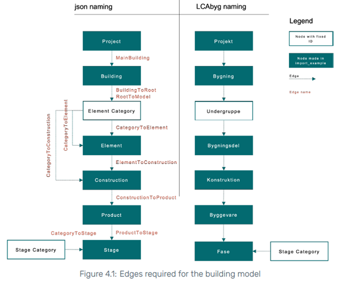

# 41934 Advanced BIM, Assignment 5 - Project Reflection
## Group 16: Isabella Vad (s183616) and Amalie Hartvig Jensen (s183619)

**The process of creating the tool**

The idea for this tool originated from experience with LCAbyg, understanding it as a software with a very time consuming and manual workflow. This complicates carrying out iterative design processes towards a more sustainable building design by lowering the CO2 emissions.   

In addition, as life cycle analysis becomes obligatory on larger buildings (>1000 m^2) by the Danish building regulations in 2023, a use case around the subject of integrating BIM in LCAbyg became increasingly relevant and the tool became likewise a great business case. 

For the time being, LCAbyg is incapable of direct integration with BIM via IFC. However, a third party integration via the JSON format is available. 
Thus the project goal was to create a tool that could retrieve necessary information from a BIM model through an IFC file and convert it into JSON files which would automatically generate results when imported in LCAbyg. 

The different project processes are described below:
- Scoping the project (goal, requirements, limitations). 
- Understanding the .json format and the .json files’ naming and layout required for LCAbyg, see Figure 1. This includes understanding the unique ID’s, the IDs connecting Nodes and Edges in the building model and the IDs referring to .csv files in LCA’s incorporated ‘gen_dk’ library.   

|  | 
|:--:| 
| *Figure 1* |

- Identify which data is needed from the .ifc file and which can be referenced by ‘gen_dk’ library. 
- Reducing the scope to only encompass one IfcBuildingElement as an example, namely IfcBeams.   
- Coding in python:
  - Load and retrieve data from the .ifc file and create a matrix with the data.
  - Load necessary .csv files from ‘gen_dk’ library.
  - Setup templates for the .json files. 
  - In templates; reference to matrix for variable model data, generate unique ID’s and cross reference ID’s between .json files/.csv files.   
  - Automatic naming and generation of results as an ‘output’ folder with the final filled out .json files. 

Several options for the tool were considered at the beginning of the project. Both HTML, Speckle, web IFCjs were considered for the project platform however we chose to work exclusively in python. 
Another consideration regarded how to retrieve the EPDs associated to the materials in the BIM model. We investigated the possibility of doing web scraping from the Ökobaudat database, but we ended up using the generic database ‘gen_dk’ incorporated in LCAbyg as a simplified solution.

**The output of the tool**

**Link to Github:** https://github.com/AmalieHJ/Advanced-BIM-A5
